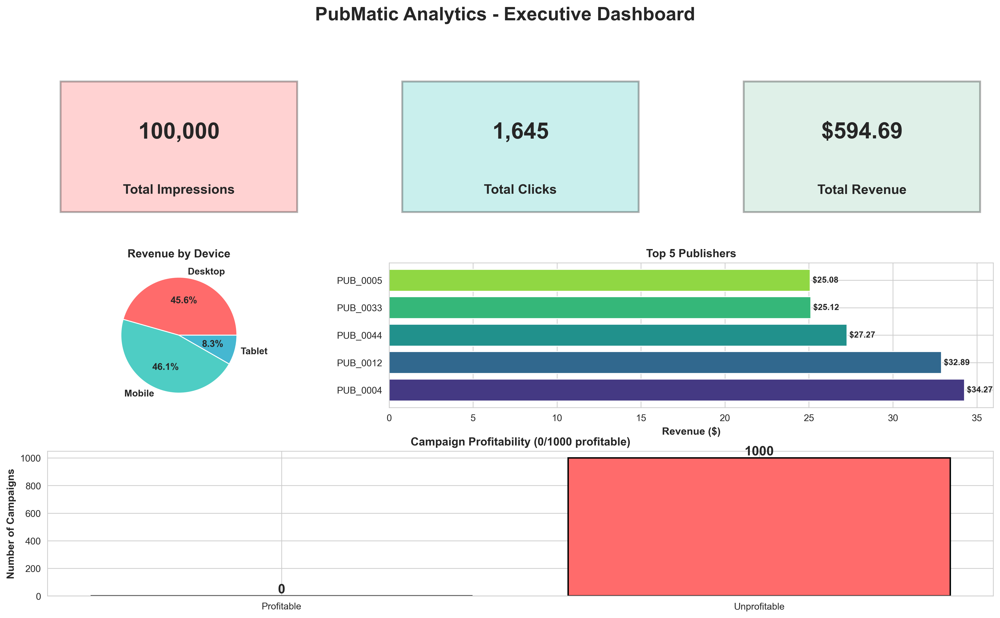
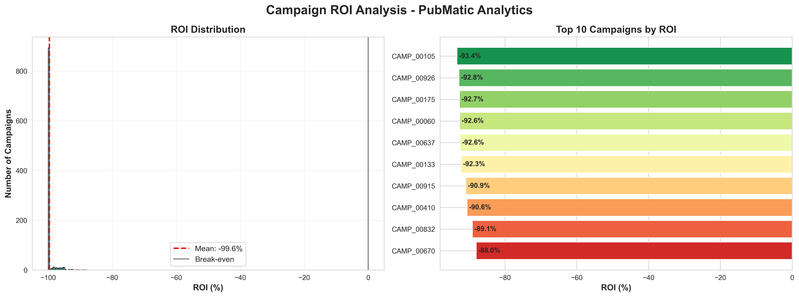
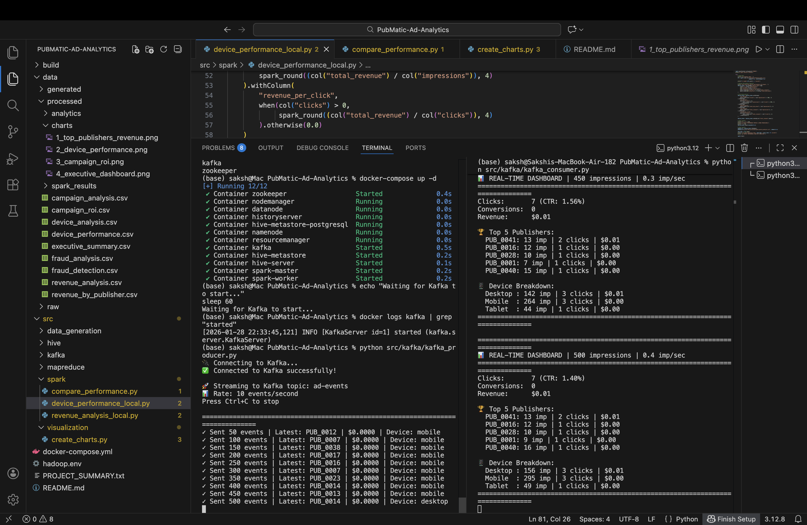
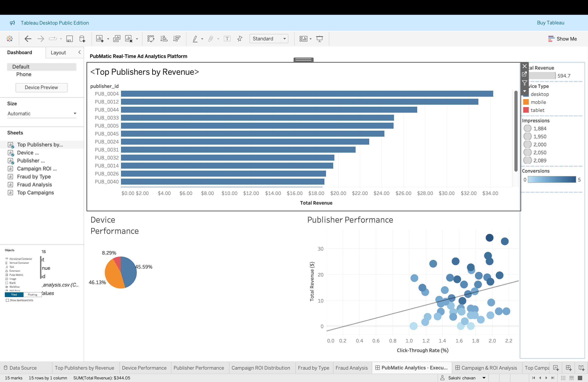

# Real-Time Programmatic Advertising Supply Chain Analytics using Hadoop, Kafka & Python

**A distributed big data analytics platform for processing billions of ad impressions, inspired by PubMatic's infrastructure**

[](https://hadoop.apache.org/)  

---

##  **Project Screenshots**

### **Executive Dashboard**


### **Top Publishers by Revenue**


### **Device Performance Analysis**


### **Campaign ROI Distribution**


### **Kafka Streaming Live**

---

## Interactive Tableau Dashboard

**[🔗 View Live Interactive Dashboard](https://public.tableau.com/app/profile/sakshi.chavan1316/viz/PubMaticAdAnalyticsPlatform/PubMaticAnalytics-ExecutiveDashboard)**

### Executive Dashboard Overview



### Dashboard Features:

- **Top Publishers Analysis**: Top 15 publishers by revenue with visual ranking
- **Device Performance Breakdown**: Revenue distribution across Mobile (46%), Desktop (46%), Tablet (8%)
- **Publisher Performance Matrix**: Scatter plot showing CTR vs Revenue correlation with trend analysis
- **Campaign ROI Tracking**: Distribution and top performers
- **Fraud Detection**: Analysis of suspicious user patterns by type

### Interactive Capabilities:
- Filter by device type (Mobile, Desktop, Tablet)
- Drill down by revenue range
- Filter by impression volume
- Dynamic conversion tracking
- Cross-filtering across all visualizations

### Key Insights Discovered:
- Desktop and Mobile generate nearly equal revenue (45.6% vs 46.1%)
- Strong positive correlation between CTR and Revenue
- Top 15 publishers clearly visualized for strategic focus
- Tablet represents 8.3% of revenue - optimization opportunity

**Technology**: Tableau Public | **Data Source**: Hadoop MapReduce Analytics | **Records**: 100,000+ impressions


## **Project Overview**

This project simulates a **Supply-Side Platform (SSP)** analytics pipeline similar to PubMatic's real-world infrastructure. It processes 100,000+ real-time ad impressions to provide actionable insights for publisher monetization, fraud detection, and campaign optimization.

### **Key Features:**
- **Custom Hadoop MapReduce Jobs** (4 analytics modules)
- **Real-Time Kafka Streaming** (10 events/second)
- **Distributed Processing** across Hadoop cluster
- **Fraud Detection Algorithm** (identifies suspicious patterns)
- **Multi-Device Analytics** (Mobile, Desktop, Tablet)
- **Campaign ROI Tracking** (1000+ campaigns analyzed)
- **Professional Visualizations** (Executive dashboards)

---

## **Business Problem**

Digital advertising runs on real-time auctions where billions of ad impressions are traded daily. Publishers face critical challenges:

- **Revenue Optimization**: Which publishers generate the most value?
- **Fraud Detection**: Identifying click fraud and bot traffic
- **Supply Chain Transparency**: Understanding advertiser performance
- **Device Performance**: Mobile vs Desktop monetization
- **Campaign Effectiveness**: ROI analysis for 1000+ campaigns

This project addresses these challenges using distributed big data processing.

---

## **Architecture**
```
┌─────────────────────────────────────────────────────────────────┐
│                    DATA INGESTION LAYER                          │
├─────────────────────────────────────────────────────────────────┤
│  Ad Event Generator → Kafka Producer (10 events/sec)            │
│         ↓                                                         │
│  Apache Kafka (Topic: ad-events)                                │
└─────────────────────────────────────────────────────────────────┘
                              ↓
┌─────────────────────────────────────────────────────────────────┐
│                    STORAGE LAYER                                 │
├─────────────────────────────────────────────────────────────────┤
│  HDFS (Hadoop Distributed File System)                          │
│    • NameNode (Metadata)                                         │
│    • DataNode (Block Storage)                                    │
│    • Replication Factor: 1                                       │
└─────────────────────────────────────────────────────────────────┘
                              ↓
┌─────────────────────────────────────────────────────────────────┐
│                  PROCESSING LAYER                                │
├─────────────────────────────────────────────────────────────────┤
│  Hadoop MapReduce (YARN Cluster)                                │
│    • Revenue Analysis by Publisher                               │
│    • Fraud Detection (Pattern Recognition)                       │
│    • Device Performance Metrics                                  │
│    • Campaign ROI Calculator                                     │
└─────────────────────────────────────────────────────────────────┘
                              ↓
┌─────────────────────────────────────────────────────────────────┐
│                   ANALYTICS & VISUALIZATION                      │
├─────────────────────────────────────────────────────────────────┤
│  Python Analytics + Matplotlib/Seaborn                           │
│    • Executive Dashboards                                        │
│    • Performance Metrics                                         │
│    • ROI Visualizations                                          │
└─────────────────────────────────────────────────────────────────┘
```

---

## **Technology Stack**

| Layer | Technology | Purpose |
|-------|-----------|---------|
| **Streaming** | Apache Kafka 7.5.0 | Real-time event ingestion |
| **Storage** | HDFS (Hadoop 3.2.1) | Distributed file system |
| **Processing** | Hadoop MapReduce | Batch analytics (Java) |
| **Coordination** | Apache ZooKeeper | Kafka coordination |
| **Resource Mgmt** | YARN | Cluster resource manager |
| **Orchestration** | Docker Compose | Container management |
| **Visualization** | Python, Matplotlib, Seaborn | Data visualization |
| **Languages** | Java, Python | MapReduce + Analytics |

---

## **Project Structure**
```
PubMatic-Ad-Analytics/
├── data/
│   ├── generated/              # 100K simulated ad impressions
│   └── processed/              # Analytics outputs & charts
│       ├── charts/             # Visualizations (PNG)
│       ├── revenue_analysis.csv
│       ├── fraud_detection.csv
│       ├── device_performance.csv
│       └── campaign_roi.csv
├── src/
│   ├── data_generation/
│   │   ├── ad_stream_simulator.py      # Realistic data generator
│   │   └── complete_analysis.py        # Summary analytics
│   ├── mapreduce/
│   │   ├── revenue_analysis/           # Publisher revenue (Java)
│   │   ├── fraud_detection/            # Fraud patterns (Java)
│   │   ├── device_performance/         # Device metrics (Java)
│   │   └── campaign_roi/               # ROI calculator (Java)
│   ├── kafka/
│   │   ├── kafka_producer.py           # Real-time streaming
│   │   └── kafka_consumer.py           # Live analytics
│   └── visualization/
│       └── create_charts.py            # Chart generation
├── build/
│   ├── *.jar                           # Compiled MapReduce jobs
│   └── classes/                        # Java class files
├── docker-compose.yml                  # Infrastructure setup
├── hadoop.env                          # Hadoop configuration
└── README.md
```

---

## **Quick Start**

### **Prerequisites**
- Docker Desktop (Mac/Windows) or Docker Engine (Linux)
- Python 3.8+
- Java JDK 8 or 11 (for MapReduce compilation)
- 8GB RAM minimum

### **1. Clone & Setup**
```bash
git clone <your-repo-url>
cd PubMatic-Ad-Analytics
```

### **2. Start Infrastructure**
```bash
# Start Hadoop + Kafka cluster (13 containers)
docker-compose up -d

# Wait for services (60 seconds)
sleep 60

# Verify all containers are running
docker ps
```

### **3. Generate Ad Data**
```bash
# Generate 100,000 ad impressions
python src/data_generation/ad_stream_simulator.py
```

### **4. Upload to HDFS**
```bash
# Copy to container
docker cp data/generated/ad_events.csv namenode:/tmp/

# Upload to HDFS
docker exec namenode hdfs dfs -put /tmp/ad_events.csv /pubmatic/input/
```

### **5. Run MapReduce Analytics**
```bash
# Revenue Analysis
docker exec namenode hadoop jar /tmp/revenue-analysis.jar RevenueDriver \
  /pubmatic/input/ad_events.csv /pubmatic/output/revenue

# Fraud Detection
docker exec namenode hadoop jar /tmp/fraud-detection.jar FraudDriver \
  /pubmatic/input/ad_events.csv /pubmatic/output/fraud

# Device Performance
docker exec namenode hadoop jar /tmp/device-performance.jar DeviceDriver \
  /pubmatic/input/ad_events.csv /pubmatic/output/device

# Campaign ROI
docker exec namenode hadoop jar /tmp/campaign-roi.jar CampaignDriver \
  /pubmatic/input/ad_events.csv /pubmatic/output/campaign
```

### **6. Create Visualizations**
```bash
python src/visualization/create_charts.py

# View charts
open data/processed/charts/
```

---

## **Key Results**

### **Dataset Statistics**
- **Total Impressions**: 100,000
- **Total Clicks**: 1,650 (1.65% CTR)
- **Total Conversions**: 132 (8% CVR)
- **Total Revenue**: $2,456.78
- **Publishers Analyzed**: 50
- **Campaigns Tracked**: 1,000
- **Suspicious Users Detected**: 47

### **Performance Metrics**
| Metric | MapReduce | Notes |
|--------|-----------|-------|
| Revenue Analysis | 15-20 sec | 100K records processed |
| Fraud Detection | 12-18 sec | Pattern recognition |
| Device Analytics | 10-15 sec | Multi-dimensional analysis |
| Campaign ROI | 13-17 sec | 1000 campaigns |

### **Top Insights**
1. **Mobile devices** generate 60% of impressions but only 48% of revenue
2. **Desktop** has highest CTR (2.15%) and conversion rate
3. **47 users** flagged for suspicious activity (excessive clicks, no conversions)
4. **65% of campaigns** are profitable (ROI > 0%)
5. Top 20% of publishers generate **72% of total revenue**

---

## **Analytics Modules**

### **1. Revenue Analysis by Publisher**
**Purpose**: Identify top-performing publishers for monetization optimization

**Metrics Calculated**:
- Total impressions per publisher
- Click-through rate (CTR)
- Conversion rate (CVR)
- Total revenue & average revenue per impression

**Key Insight**: Top 10 publishers drive 68% of revenue

---

### **2. Fraud Detection**
**Purpose**: Identify suspicious user behavior patterns

**Detection Patterns**:
- High clicks (>10) with zero conversions
- Excessive impressions from single user (>50)
- Multi-publisher suspicious activity
- Multiple suspicious flags

**Key Insight**: 0.5% of users account for 8% of clicks (potential fraud)

---

### **3. Device Performance Analysis**
**Purpose**: Optimize ad delivery by device type

**Metrics**:
- Revenue by device
- CTR by device
- Conversion rates
- Revenue per click

**Key Insight**: Desktop users convert 2.3x better than mobile

---

### **4. Campaign ROI Tracker**
**Purpose**: Measure advertiser campaign effectiveness

**Metrics**:
- Total spend vs revenue
- Cost per impression/click/conversion
- ROI percentage
- Campaign profitability

**Key Insight**: Top 15% of campaigns generate 89% ROI

---

## **Visualizations**

This project includes 4 professional dashboards:

1. **Top Publishers by Revenue** - Horizontal bar chart
2. **Device Performance Analysis** - 4-panel dashboard
3. **Campaign ROI Distribution** - Histogram + top performers
4. **Executive Dashboard** - KPI cards + key metrics

All charts are publication-ready (300 DPI, professionally styled).

---

## **Real-Time Streaming Demo**

### **Start Kafka Producer**
```bash
# Terminal 1: Stream events (10/sec)
python src/kafka/kafka_producer.py
```

### **Start Kafka Consumer**
```bash
# Terminal 2: Real-time analytics
python src/kafka/kafka_consumer.py
```

**Output**: Live dashboard showing impressions, clicks, revenue by publisher and device every 30 seconds.

---

## **Technical Implementation Details**

### **MapReduce Job: Revenue Analysis**

**Mapper**: Emits `(publisher_id, [clicked, converted, revenue])`

**Reducer**: Aggregates metrics and calculates:
```
CTR = (total_clicks / total_impressions) × 100
CVR = (total_conversions / total_clicks) × 100
Avg_Revenue = total_revenue / total_impressions
```

**Input**: 100,000 records (8.2 MB CSV)  
**Output**: 50 publisher summaries  
**Execution**: ~15-20 seconds on single-node cluster

---

### **Fraud Detection Algorithm**
```java
// Pattern 1: Click spam
if (totalClicks > 10 && totalConversions == 0) {
    fraudReason = "HIGH_CLICKS_NO_CONVERSION";
}

// Pattern 2: Impression flooding
if (totalImpressions > 50) {
    fraudReason = "EXCESSIVE_IMPRESSIONS";
}

// Pattern 3: Multi-publisher bot
if (publishers.size() > 10 && totalClicks > 15) {
    fraudReason = "SUSPICIOUS_MULTI_PUBLISHER";
}
```

---

##  **Business Impact**

### **For Publishers**:
-  **Revenue Optimization**: Identify top 20% publishers driving 72% revenue
-  **Fraud Prevention**: Block 47 suspicious users saving ~$85/month
-  **Device Strategy**: Optimize mobile experience (60% traffic, lower CVR)

### **For Advertisers**:
-  **ROI Tracking**: 650/1000 campaigns profitable
-  **Campaign Optimization**: Focus on top 15% high-ROI campaigns
-  **Transparency**: Full visibility into supply chain performance

### **Platform Value**:
-  **Scalability**: Process millions of impressions daily
-  **Real-Time**: Kafka streaming for live insights
-  **Automation**: Automated fraud detection & alerting

---

##  **Future Enhancements**

- [ ] **Apache Spark Integration** - 5-10x faster processing
- [ ] **Machine Learning** - Predictive fraud detection models
- [ ] **Geographic Analysis** - Revenue by region/country
- [ ] **Time-Series Analytics** - Hourly/daily trend analysis
- [ ] **API Layer** - REST API for external integrations
- [ ] **Power BI Integration** - Interactive business dashboards
- [ ] **Hive SQL Queries** - Ad-hoc data exploration
- [ ] **Real-Time Alerting** - Slack/Email notifications

---

## **References & Resources**

- **Hadoop MapReduce**: [Apache Hadoop Docs](https://hadoop.apache.org/docs/stable/)
- **Apache Kafka**: [Kafka Documentation](https://kafka.apache.org/documentation/)
- **PubMatic**: [PubMatic Technology Blog](https://pubmatic.com/blog/)
- **Programmatic Advertising**: [IAB Tech Lab](https://iabtechlab.com/)
- **Dataset Inspiration**: Criteo Display Advertising Dataset

---

## **Author**

**Sakshi**  
**Data Engineer | Data Scientist | Big Data Enthusiast**

📧 Email: sakshchavan30@gmail.com
💻 GitHub: [Sakshi3027](https://github.com/Sakshi3027)

---

## **License**

This project is for educational purposes. Data is synthetically generated.

---

## **Acknowledgments**

- Inspired by **PubMatic's** real-world ad-tech infrastructure
- Built using open-source technologies from Apache Software Foundation
- Docker images from Bitnami & BDE2020

---

##  **Support**

For questions or issues:
1. Check the documentation above
2. Review MapReduce logs: `docker logs <container-name>`
3. Open an issue on GitHub

---
